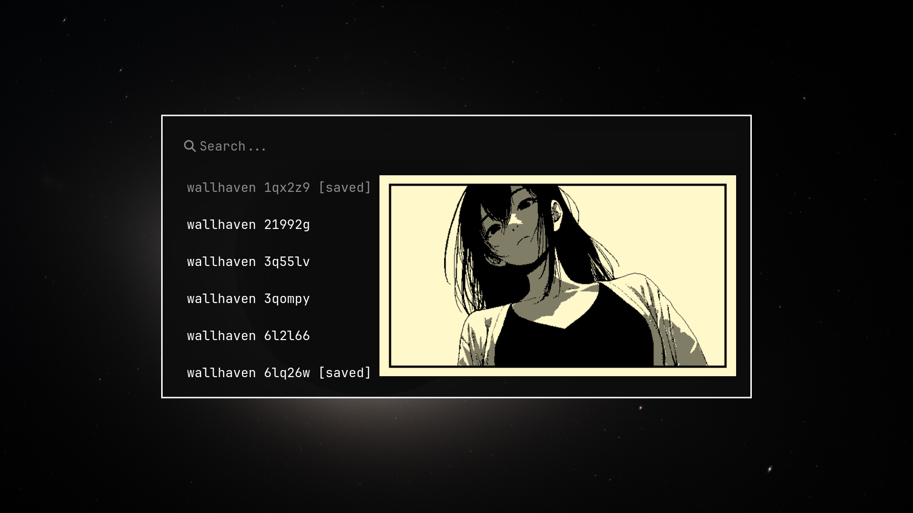
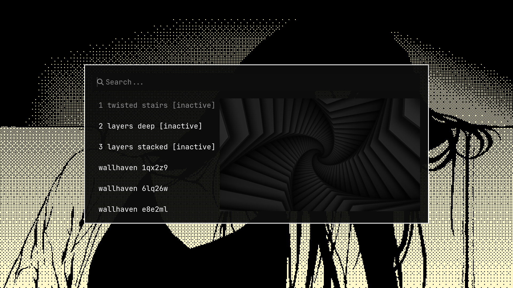
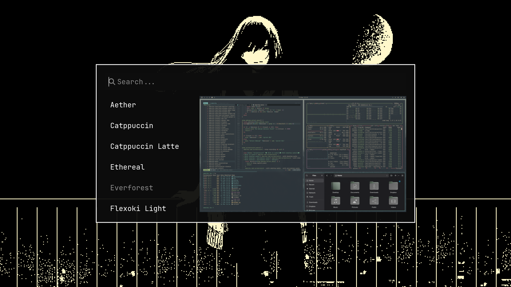

# omarchy-aether-wallpapers

Per-theme wallpaper management for [Omarchy](https://omarchy.org) + [Aether](https://github.com/bjarneo/aether). Save Aether favorites to themes, cycle through them, deactivate or delete via Walker menus and keybindings.

## Requirements

- [Omarchy](https://omarchy.org)
- [Aether](https://github.com/bjarneo/aether)
- `jq`, `curl`

## Install

```bash
git clone https://github.com/dleerdefi/omarchy-aether-wallpapers.git
cd omarchy-aether-wallpapers
./install.sh
```

## Uninstall

```bash
./uninstall.sh
```

Wallpapers and theme backgrounds are not removed.

## Keybindings

| Keybind | Action |
|---------|--------|
| `Super+Shift+S` | Save Aether wallpaper to current theme |
| `Super+Shift+Alt+S` | Cycle to next wallpaper |
| `Super+Shift+R` | Manage theme wallpapers |
| `Super+Shift+Alt+W` | Switch theme |

In the remove menu (`Super+Shift+R`):

| Key | Action |
|-----|--------|
| `Enter` | Deactivate (or reactivate if `[inactive]`) |
| `Ctrl+D` | Permanently delete |

## How it works

**Save** (`Super+Shift+S`) lists all Aether favorites and local wallpapers. Undownloaded favorites are fetched in the background and show as `[downloading]` until cached. Already-saved wallpapers are marked `[saved]`.



**Cycle** (`Super+Shift+Alt+S`) rotates through bundled theme backgrounds and user-added ones.

**Remove** (`Super+Shift+R`) lists all wallpapers in the current theme. Deactivating moves a wallpaper to `.inactive/` (hidden from cycling, restorable). Deleting removes it permanently. If the active wallpaper is removed, the next one is shown automatically.



**Switch theme** (`Super+Shift+Alt+W`) opens the Omarchy theme picker with previews.



## License

MIT
